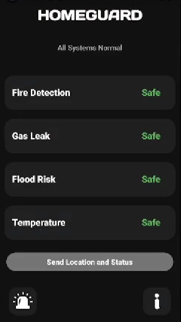
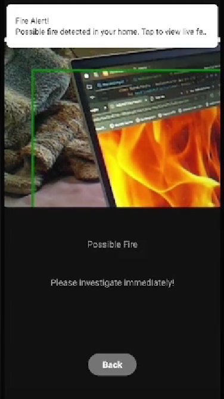
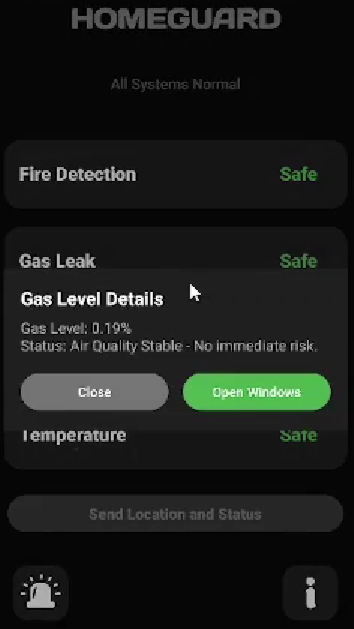
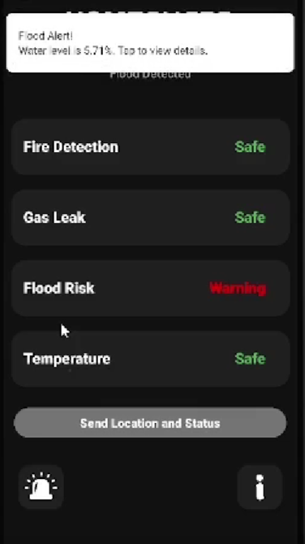
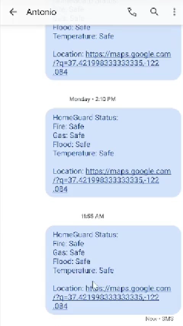
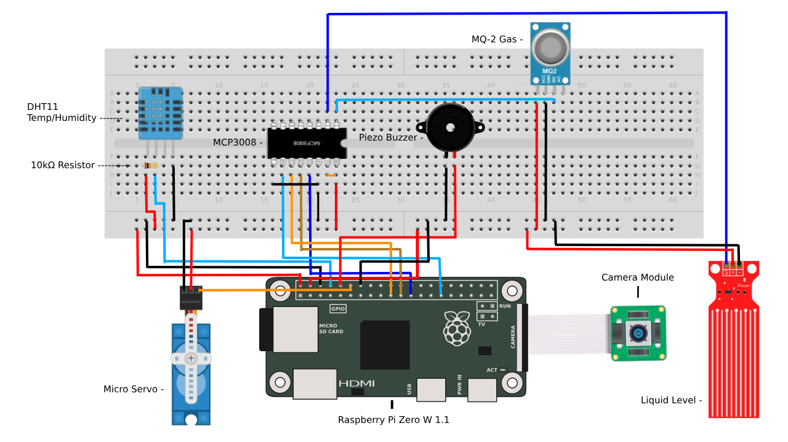

# 🏠 HomeGuard

**HomeGuard** is an Android + Raspberry Pi-powered home safety system that monitors your home environment for hazards like fire, gas leaks, or flooding. It connects to a Firebase Realtime Database that collects sensor readings for a Raspberry Pi, helping users get notified instantly.

---

## 🚀 Features

- Monitors **fire**, **gas**, **temperature/humidity** and **flood** dangers in real-time
- **Trained fire detection camera model** monitors live feed and sends alerts
- Alerts sent automatically from a Raspberry Pi to Firebase  
- Built-in **panic button** sends your home's status to an emergency contact  
- Sends **push notifications** when a hazard is detected
- Uses a **micro servo motor** to simulate window ventilation during gas/flood alerts  
- Activates a **piezo buzzer** for local audio alarms
- Simple and responsive UI for fast action  

---

## 🖼️ **Screenshots**

<table>
  <tr>
    <td align="center"><b>Home</b></td>
    <td align="center"><b>Fire Alert</b></td>
    <td align="center"><b>Dialog Example</b></td>
  </tr>
  <tr>
    <td></td>
    <td></td>
    <td></td>
  </tr>
  <tr>
    <td align="center"><b>Warning Example</b></td>
    <td align="center"><b>Panic Text</b></td>
    <td align="center"><b>Emergency Call</b></td>
  </tr>
  <tr>
    <td></td>
    <td></td>
    <td></td>
  </tr>
</table>

## 🔌 Wiring Diagram

<p align="center">
  
</p>

---

## 🛠️ Tech Stack

- **Kotlin** and Jetpack Libraries
- **Firebase Realtime Database**
- **Raspberry Pi + Python**
- **HTML + Flask**

---

## ⚙️ Setup & Requirements

### 📱 Android App

1. Clone the repo:
   ```bash
   git clone https://github.com/AntoOfo/HomeGuard
   cd HomeGuard
   ```
2. Open the project in Android Studio

3. Let Gradle sync and install all dependencies

4. Add IP to **CameraActivity.kt** and **network_security_config.xml**

5. Run on a device or emulator

### 🧠 Raspberry Pi + Firebase

#### 🔧 Hardware Components Used

- Raspberry Pi Zero W (or similar)
- DHT11
- Water Level Sensor
- MQ Gas Sensor (MQ-2 or MQ-5)
- Camera Module
- Micro Servo Motor
- Piezo Buzzer
- MCP3208 ADC
- Male-to-Male Jumper Wires
- Female-to-Male Jumper Wires

#### 🔌 Raspberry Pi Setup

1. Set up a Firebase Realtime Database

2. Download a **google-services.json** file from the Firebase Console

3. Place it in your **/app** directory of the Android project

4. Use the same Firebase Database URL in your Raspberry Pi script to send sensor values

---

## 📁 License

Licensed under the MIT License.
